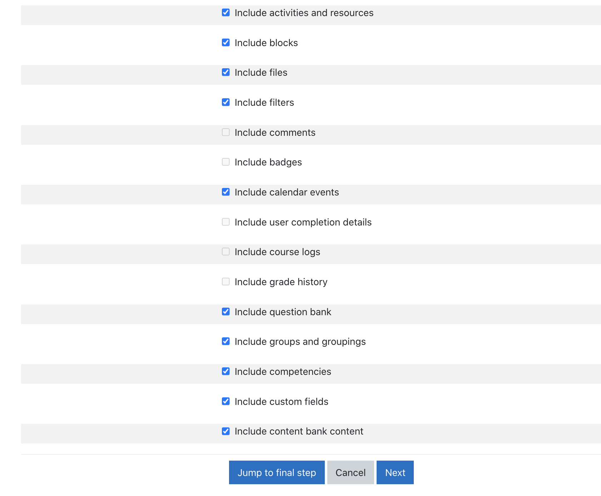
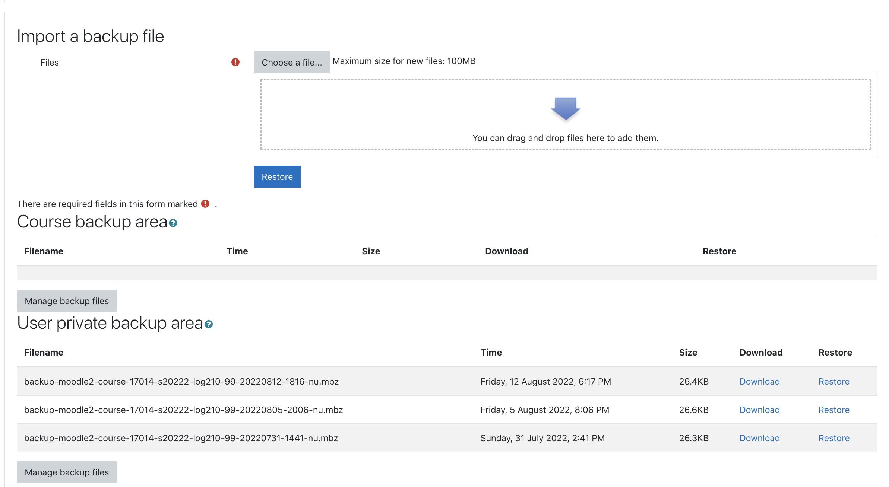
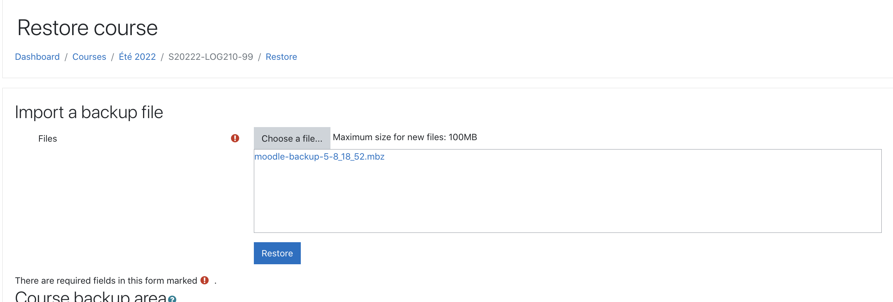

# Activity connector <!-- omit in toc -->

NPM Package: Activity connector for Moodle.
This command-line tool allows synchronizing dates of Moodle activities (in a Moodle backup file) with events in a calendar (.ics) file.

## Table of contents <!-- omit in toc -->

- [Installation](#installation)
- [Usage](#usage)
- [Activity planner](#activity-planner)
  - [Start/End times of calendar events](#startend-times-of-calendar-events)
  - [Relative time modifiers](#relative-time-modifiers)
  - [Absolute time modifier](#absolute-time-modifier)
  - [List of activities that can be configured](#list-of-activities-that-can-be-configured)
- [Moodle step by step](#moodle-step-by-step)
  - [Step 1. Create a Moodle backup file](#step-1-create-a-moodle-backup-file)
  - [Step 2. Create an activity planner file (.dsl)](#step-2-create-an-activity-planner-file-dsl)
  - [Step 3. Create or get a calendar file](#step-3-create-or-get-a-calendar-file)
  - [Step 4. Use the create command](#step-4-use-the-create-command)
  - [Step 5. Import the new Moodle file using the UI](#step-5-import-the-new-moodle-file-using-the-ui)
- [Execute tests on local machine](#execute-tests-on-local-machine)
- [Test lib](#test-lib)

## Installation

You can install the latest npm release by using the following command in your terminal:
```bash
npm install -g activity-connector
```

For local development, you can simply run the activity-connector.js file directly. 

## Usage

```activity-connector``` or ```a-c``` (shortcut) will show you the help section of every command available in the command-line tool. You can then use ```activity-connector <command_name> --help``` to see the help for every command.

For example,

```bash
activity-connector create -h
```

will output the following help information:

```text
Usage: activity-connector create [options]

Create a new, updated backup (.mbz) file using an existing backup (.mbz) file from Moodle,  
a plan (.dsl) file and the calendar of course events (.ics).

Example: create -mp ./path/to/file.mbz -dp ./path/to/file.dsl -a LOG210 -g 01 -y 2022 -s Summer
         create -mp ./path/to/file.mbz -dp ./path/to/file.dsl -if ./path/to/file.ics

Options:
  -mp --mbzpath <directory>   (required) the path of the Moodle backup (.mbz) file
  -dp, --dslpath <directory>  (required) the path to the plan (.dsl) file
  -if, --icsfile <directory>  the path to the calendar (.ics) file
  -a, --acronym <course>      the École de technologie supérieure course's acronym
                                (e.g., LOG210, GTI745, MEC200, ...)
  -g, --group <number>        the group number for the École de technologie supérieure
                                course (if the group is a single digit, add a  
                                0 in front e.g., 01, 02, ...)
  -y --year <number>          the year of the École de technologie supérieure course,
                                e.g., 2022
  -s --semester <name>        the École de technologie supérieure semester's name.
                                The options are Winter, Summer or Fall.
  -h, --help                  display help for command
  ```

Examples of command executions are provided in the help.

## Activity planner

This application uses a Peg.js file to parse a simple (domain specific) language to specify activities, events and dates.
This section provides the general rules of this activity planner.

There are 3 main calendar activities (events):

- Seminars (`S`), i.e., the repeating events of when students meet for class with an instructor,
- Laboratories (`L`), i.e., the repeating events when students meet for labs with a lab assistant,
- Practica (`P`), i.e., the repeating events when students meet for work on exercises with a tutor (like a lab, but different).

Here are the main Moodle activities:

- Quiz (`Q`)
- Exam (`E`), technically a quiz, but has the word `exam` in the title.
- Homework (`H`)

These Moodle activities can be planned relative to calendar activities.
The tool modifies the Moodle activity date(s) according to the calendar date and the synchronization settings in the planning file.

`<activity to plan> <start time of activity> <end time of activity>`

To define *a Quiz 1 that is opened at the start of Seminar 1 and ends at the start of Practicum 2*, you should write `Q1 S1 P2`

- Q1 stands for Quiz 1;
- S1 stands for Seminar 1;
- P2 stands for Practicum 2.

### Start/End times of calendar events

You can specify `F` to get the end time of an event.
For example, the end of Seminar 2 is specified with `S2F`.
You can specify `S` to get the start time of an event.
By default, if none is specified, the start time will be picked.

For example, to specify that Quiz 1 opens at the end of Seminar 1 and closes at the start of Practicum 2 would be `Q1 S1F P2S`

### Relative time modifiers

You can add or subtract a certain amount of time from event dates using `+` or `-` and time units:

- minutes: `m`
- hours: `h`
- days: `d`
- weeks: `w`

Example: to specify that Quiz 1 opens 30 minutes after Seminar 1 ends and closes 15 minutes before Practicum 2 would be `Q1 S1+30m P2-15m`

### Absolute time modifier

You can also specify specific times of an event using the `@hh:mm` (24-hour) annotation.

Example: to specify the end of the day (23:55) of Seminar 1, it would be `S1@23:55`

You can combine this modifier with the relative one:

Example: to specify the end of the day (23:55) before Seminar 1, it would be `S1-1d@23:55`

Note: the absolute time modifier must be used *after* the relative one, e.g., `S1-1d@23:55` is valid, but `S1@23:55-1d` is **invalid**.

### List of activities that can be configured

- Quiz: `<Qn> <start of quiz> <end of quiz>`
- Homework: `<Hn> <open date> <due date> <cutoff date>`
- Exam: `<En> <start date>` (the end date is deduced by the length of the exam in Moodle)

## Moodle step by step

The following section will guide you through using the application to modify the dates of activities in a Moodle course.

> Because this tool modifies a backup file that will later be used to restore (and overwrite) activities in the course, it is highly recommended that you use this tool *before* students are enrolled in the course (and have begun activities).
> **Use at your own risk!**  
> Note: these instructions may be different depending on your version of Moodle.
> This tool was tested with Moodle version 3.x.
> Please see the documentation for the various steps according to your version of Moodle.

### Step 1. Create a Moodle backup file

The first thing to do is to create a Moodle backup file.
This can be done through the Moodle UI.
You must have the teacher role in a course to do so.

To create the file, go to your Moodle class.
Use the cogwheel at the top right of your screen and click "Backup".
You can then click "Jump to final step" to export it or configure your exportation settings accordingly. 




After it finishes, you can press "Continue".
You should see your backup Moodle file in the "User private backup area" section.
Download the file and save it on your computer.



### Step 2. Create an activity planner file (.dsl)

To use the application, you must create an activity planner file that will be used to configure the dates of the existing activities in your Moodle course.
You can simply create a file in Notepad or a text editor of your choice.
For more information concerning how to write the file, please refer to this section: [Activity Planner](#activity-planner).
Here is an example of an activity planner file:

```text
Q1 S1F S2S-30m
Q2 S2F S3S-1d@23:55
H1 L2F L3S-1d@23:55 L3S-1d@23:55
```

This file states that the first two quizzes in the backup file will open at the end (F) of Seminars (S) 1 and 2 respectively.
The first quiz will close 30 minutes before Seminar 2 starts (S), and the second quiz will close at 11:55pm the day (night) before Seminar 3 starts (S).
The first homework in the backup file will open at the end (F) of Lab 2, will be due (without being late) at 11:55pm the night before Lab 3. Since there is no chance to submit it late, the third (cutoff) date is the same as the second (due) date.

### Step 3. Create or get a calendar file

This application uses an .ics file to modify the Moodle backup file.
You can refer to the `acitivity-connector parse-ics` to see if your .ics file is valid.
You can also refer to the flags of the `activity-connector create` command to not provide an .ics file and directly fetch the calendar from the school's API (specific to ETS University only).

### Step 4. Use the create command

e.g., ```activity-connector create -dp data/test.dsl -if data/Seances.ics -mp data/backup-moodle2-course-17014-s20222-log210-99-20220619-1506-nu.mbz```

The `-dp` flag is for the activity planner file path. The `-if` flag is for the .ics file path. The `-mp` flag is for the Moodle backup file path we downloaded at step 1. Further information can be found using `activity-connector create -h`. 

After using the create command, you should have a mbzPackages folder created with a new .mbz file inside it.
This is your modified Moodle file.

### Step 5. Import the new Moodle file using the UI

Go back to your Moodle course and use the cogwheel to navigate to "Restore".
You can then drag and drop the new Moodle backup file in the "Import a backup file" box.
Click "Restore".



Scroll down and click "Continue".
On the next page, you need to check "Delete the contents of this course and then restore".
If this option is not checked, your Moodle course will contain duplicated activities.
This is the reason we recommend you only use this tool on a course that does not yet have students enrolled (and possibly activities that have begun).


Click "Continue" and then "Next" on the next page.

On the current page, it is important to change "Keep current groups and groupings" and "Keep current roles and enrolments" to "Yes".
Without this change, your current roles and groups of the course will be deleted.
The users assigned in the current course would also be deleted.


Scroll down and click "Next".
On the next page, scroll down and click "Restore".
This process might take a while.
As long as a circle is spinning in your browser tab, the process is still running.
Once the process is done, check to see if your Moodle activity dates have been updated.
> The Moodle calendar is an excellent way to visualize the dates.

## Execute tests on local machine

Install node JS on local machine [https://nodejs.org/en/](Node)

Run "npm install" on the project root folder

Run "npm test" on the project root folder

## Test lib

This project uses [Jest](https://jestjs.io/docs/) for its unit testing.
